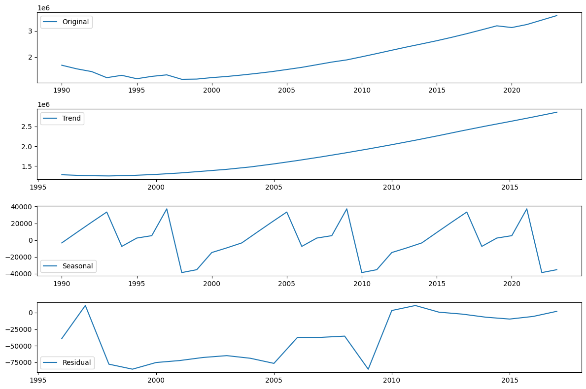
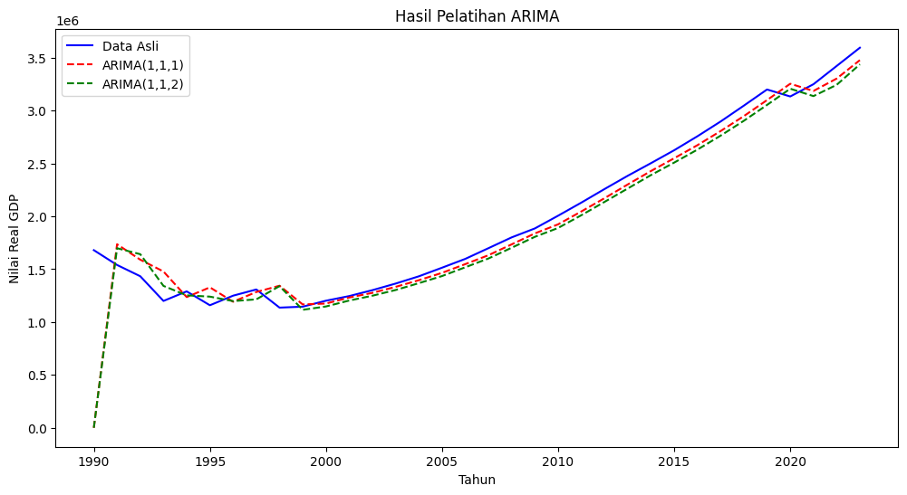
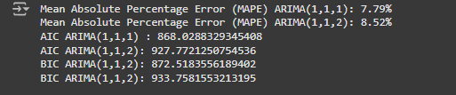
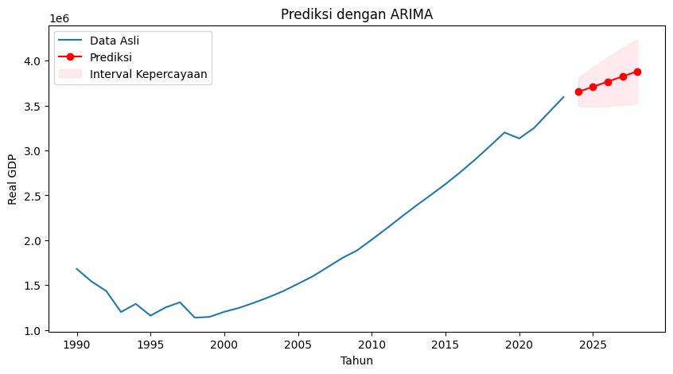
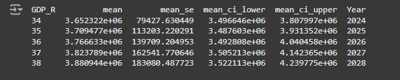

#  Indonesia Gdp Prediction 📈

Project ini dibuat untuk memprediksi GDP indonesia dalam 5 tahun kedepan dari tahun 2024 - 2028

## Dataset

Dataset utama diambil dari real dataset yang bersumber pada https://data-explorer.oecd.org/. dengan cakupan waktu dari tahun 1990 - 2023

## Data Dictionary

**Real Gdp**: Total nilai barang dan jasa yang dihasilkan oleh suatu negara setelah disesuaikan dengan inflasi.

## Data Pre-Processing

Pada tahap ini saya hanya melalukan pengecekan missing value dan duplikasi data dan didapatkan tidak ada mising value dan duplikasi pada data. 

## EDA 
### Plot Dekomposisi

**Insight** : 
- Tren positif: GDP secara keseluruhan mengalami pertumbuhan stabil dalam jangka panjang.
- Polarisasi musiman: GDP memiliki pola musiman yang jelas, yang mungkin penting untuk analisis lebih lanjut, seperti perencanaan atau prediksi ekonomi.
- Noise (residual): Sisa variabilitas setelah tren dan musiman telah dihapus relatif kecil, menunjukkan bahwa data sebagian besar dapat dijelaskan oleh komponen utama (tren dan musiman).

## Modeling
dalam pemodelan saya menggunakan model ARIMA tanpa spliting data dikarenakan data yang terbatas

## Learning Curve dan Evalusi
### Learning Curve

**Insight** : dari learning curve diatas terlihat bahwa model sangat cukup baik pada data pelatihan 

### Evaluasi 

**Insight** : Berdasarkan evaluasi keseluruhan menggunakan MAPE, AIC, dan BIC, model ARIMA(1,1,1) terbukti lebih baik dibandingkan dengan ARIMA(1,1,2) karena:

- Memiliki tingkat kesalahan prediksi yang lebih kecil (MAPE lebih rendah).
- Memiliki kecocokan model yang lebih baik (AIC lebih rendah).
- Lebih sederhana dengan penalti parameter yang lebih kecil (BIC lebih rendah).

## Prediksi
### Plot Prediksi

### Evaluasi Prediksi

**Insight** :Setelah melakukan forecasting serta dilakukan visualisasi, data Real GDP akan mengalami peningkatan jika dilihat dari prediksi pola data sebelumnya.

